# backend

## Table Of Contents

1. 0.0.1 Entities
   1. audiovisual(Audiovisual)
   2. equipment(Equipment)
   3. steps(Steps)
   4. item(Item)
   5. keep(Keep)
   6. memorial(Memorial)
   7. coop_challenge(CoopChallenge)
   8. complete(Complete)
   9. avatar(Avatar)
   10. has(Has)
   11. contraindication(Contraindication)
   12. clinical_profile(ClinicalProfile)
   13. user_account(UserAccount)
   14. routine(Routine)
   15. plan(Plan)
   16. muscle_group(MuscleGroup)
   17. measurement_parameter(MeasurementParameter)
   18. exercise(Exercise)
   19. execute(Execute)
   20. session(Session)
   21. wellness_test(WellnessTest)
   22. supervisor_note(SupervisorNote)
   23. contains(contains)
   24. restricts(restricts)
   25. presents(presents)
   26. need(need)
   27. train(train)
   28. use(use)
2. ER Diagram

## 0.0.1 Entities

### audiovisual(Audiovisual)

#### audiovisual(Audiovisual) columns

| Database Name | Property Name | Attribute | Type           | Nullable | Charset | Comment |
| ------------- | ------------- | --------- | -------------- | -------- | ------- | ------- |
| url           | url           | PK,UK     | \*varchar(255) |          |         |         |

#### audiovisual(Audiovisual) indices

| Database Name    | Property Name    | Unique | Columns |
| ---------------- | ---------------- | ------ | ------- |
| audiovisual_pkey | audiovisual_pkey | Unique |         |

### equipment(Equipment)

#### equipment(Equipment) columns

| Database Name | Property Name | Attribute | Type           | Nullable | Charset | Comment |
| ------------- | ------------- | --------- | -------------- | -------- | ------- | ------- |
| name          | name          | PK,UK     | \*varchar(255) |          |         |         |

#### equipment(Equipment) indices

| Database Name  | Property Name  | Unique | Columns |
| -------------- | -------------- | ------ | ------- |
| equipment_pkey | equipment_pkey | Unique |         |

### steps(Steps)

#### steps(Steps) columns

| Database Name | Property Name | Attribute | Type                       | Nullable | Charset | Comment |
| ------------- | ------------- | --------- | -------------------------- | -------- | ------- | ------- |
| date          | date          | PK        | \*timestamp-with-time-zone |          |         |         |
| user_id       | userId        | FK,PK,UK  | \*integer                  |          |         |         |
| num_steps     | numSteps      |           | \*int                      |          |         |         |
| is_reached    | isReached     |           | \*boolean                  |          |         |         |

#### steps(Steps) indices

| Database Name  | Property Name  | Unique | Columns |
| -------------- | -------------- | ------ | ------- |
| steps_date_idx | steps_date_idx |        |         |
| steps_pkey     | steps_pkey     | Unique |         |

### item(Item)

#### item(Item) columns

| Database Name | Property Name | Attribute | Type           | Nullable | Charset | Comment |
| ------------- | ------------- | --------- | -------------- | -------- | ------- | ------- |
| name          | name          | PK,UK     | \*varchar(255) |          |         |         |
| type          | type          |           | \*enum         |          |         |         |
| image         | image         |           | \*varchar      |          |         |         |
| cost          | cost          |           | \*integer      |          |         |         |

#### item(Item) indices

| Database Name | Property Name | Unique | Columns |
| ------------- | ------------- | ------ | ------- |
| item_pkey     | item_pkey     | Unique |         |

### keep(Keep)

#### keep(Keep) columns

| Database Name | Property Name | Attribute | Type           | Nullable | Charset | Comment |
| ------------- | ------------- | --------- | -------------- | -------- | ------- | ------- |
| item          | item          | FK,PK,UK  | \*varchar(255) |          |         |         |
| avatar        | avatar        | FK,PK,UK  | \*integer      |          |         |         |
| is_wearing    | isWearing     |           | \*boolean      |          |         |         |

#### keep(Keep) indices

| Database Name | Property Name | Unique | Columns |
| ------------- | ------------- | ------ | ------- |
| keep_pkey     | keep_pkey     | Unique |         |

### memorial(Memorial)

#### memorial(Memorial) columns

| Database Name | Property Name | Attribute | Type           | Nullable | Charset | Comment |
| ------------- | ------------- | --------- | -------------- | -------- | ------- | ------- |
| name          | name          | PK,UK     | \*varchar(255) |          |         |         |
| description   | description   |           | \*text         |          |         |         |
| image         | image         |           | \*varchar(255) |          |         |         |

#### memorial(Memorial) indices

| Database Name | Property Name | Unique | Columns |
| ------------- | ------------- | ------ | ------- |
| memorial_pkey | memorial_pkey | Unique |         |

### coop_challenge(CoopChallenge)

#### coop_challenge(CoopChallenge) columns

| Database Name | Property Name | Attribute | Type                       | Nullable | Charset | Comment |
| ------------- | ------------- | --------- | -------------------------- | -------- | ------- | ------- |
| name          | name          | PK,UK     | \*varchar(255)             |          |         |         |
| start_date    | startDate     |           | \*timestamp-with-time-zone |          |         |         |
| end_date      | endDate       |           | \*timestamp-with-time-zone |          |         |         |
| status        | status        |           | \*enum                     |          |         |         |
| total_steps   | totalSteps    |           | \*integer                  |          |         |         |
| memorial      | memorial      | FK,UK     | varchar(255)               | Nullable |         |         |

#### coop_challenge(CoopChallenge) indices

| Database Name                  | Property Name                  | Unique | Columns |
| ------------------------------ | ------------------------------ | ------ | ------- |
| coop_challenge_pkey            | coop_challenge_pkey            | Unique |         |
| REL_85a323b8b26e0a651bb8422395 | REL_85a323b8b26e0a651bb8422395 | Unique |         |

### complete(Complete)

#### complete(Complete) columns

| Database Name | Property Name | Attribute | Type           | Nullable | Charset | Comment |
| ------------- | ------------- | --------- | -------------- | -------- | ------- | ------- |
| challenge     | challenge     | FK,PK,UK  | \*varchar(255) |          |         |         |
| avatar        | avatar        | FK,PK,UK  | \*integer      |          |         |         |

#### complete(Complete) indices

| Database Name | Property Name | Unique | Columns |
| ------------- | ------------- | ------ | ------- |
| complete_pkey | complete_pkey | Unique |         |

### avatar(Avatar)

#### avatar(Avatar) columns

| Database Name | Property Name | Attribute | Type      | Nullable | Charset | Comment |
| ------------- | ------------- | --------- | --------- | -------- | ------- | ------- |
| id            | id            | PK,UK     | \*integer |          |         |         |
| fp            | fp            |           | \*integer |          |         |         |

#### avatar(Avatar) indices

| Database Name | Property Name | Unique | Columns |
| ------------- | ------------- | ------ | ------- |
| avatar_pkey   | avatar_pkey   | Unique |         |

### has(Has)

#### has(Has) columns

| Database Name | Property Name | Attribute | Type           | Nullable | Charset | Comment |
| ------------- | ------------- | --------- | -------------- | -------- | ------- | ------- |
| memorial      | memorial      | FK,PK,UK  | \*varchar(255) |          |         |         |
| user_id       | userId        | FK,PK,UK  | \*integer      |          |         |         |

#### has(Has) indices

| Database Name | Property Name | Unique | Columns |
| ------------- | ------------- | ------ | ------- |
| has_pkey      | has_pkey      | Unique |         |

### contraindication(Contraindication)

#### contraindication(Contraindication) columns

| Database Name | Property Name | Attribute | Type           | Nullable | Charset | Comment |
| ------------- | ------------- | --------- | -------------- | -------- | ------- | ------- |
| name          | name          | PK,UK     | \*varchar(255) |          |         |         |
| description   | description   |           | text           | Nullable |         |         |

#### contraindication(Contraindication) indices

| Database Name         | Property Name         | Unique | Columns |
| --------------------- | --------------------- | ------ | ------- |
| contraindication_pkey | contraindication_pkey | Unique |         |

### clinical_profile(ClinicalProfile)

#### clinical_profile(ClinicalProfile) columns

| Database Name         | Property Name        | Attribute | Type      | Nullable | Charset | Comment |
| --------------------- | -------------------- | --------- | --------- | -------- | ------- | ------- |
| id                    | id                   | FK,PK,UK  | \*integer |          |         |         |
| omop_person_id        | omopPersonId         |           | integer   | Nullable |         |         |
| age                   | age                  |           | \*integer |          |         |         |
| biological_sex        | biologicalSex        |           | \*enum    |          |         |         |
| tanner_stage          | tannerStage          |           | enum      | Nullable |         |         |
| height                | height               |           | \*integer |          |         |         |
| weight                | weight               |           | \*integer |          |         |         |
| bmi                   | bmi                  |           | numeric   | Nullable |         |         |
| bmi_percentile        | bmiPercentile        |           | numeric   | Nullable |         |         |
| prior_conditions      | priorConditions      |           | text      | Nullable |         |         |
| current_comorbidities | currentComorbidities |           | text      | Nullable |         |         |
| family_history        | familyHistory        |           | text      | Nullable |         |         |
| birth_date            | birthDate            |           | \*date    |          |         |         |
| diagnosis             | diagnosis            |           | \*varchar |          |         |         |
| treatment_end_date    | treatmentEndDate     |           | \*date    |          |         |         |
| hospital              | hospital             |           | \*varchar |          |         |         |

#### clinical_profile(ClinicalProfile) indices

| Database Name         | Property Name         | Unique | Columns |
| --------------------- | --------------------- | ------ | ------- |
| clinical_profile_pkey | clinical_profile_pkey | Unique |         |

### user_account(UserAccount)

#### user_account(UserAccount) columns

| Database Name | Property Name | Attribute | Type           | Nullable | Charset | Comment |
| ------------- | ------------- | --------- | -------------- | -------- | ------- | ------- |
| id            | id            | PK,UK     | \*integer      |          |         |         |
| password      | password      |           | \*varchar(255) |          |         |         |
| avatar        | avatar        | FK,UK     | \*integer      |          |         |         |

#### user_account(UserAccount) indices

| Database Name                  | Property Name                  | Unique | Columns |
| ------------------------------ | ------------------------------ | ------ | ------- |
| user_account_pkey              | user_account_pkey              | Unique |         |
| REL_6ab6ac26877fe9377483630d65 | REL_6ab6ac26877fe9377483630d65 | Unique |         |

### routine(Routine)

#### routine(Routine) columns

| Database Name    | Property Name  | Attribute | Type           | Nullable | Charset | Comment |
| ---------------- | -------------- | --------- | -------------- | -------- | ------- | ------- |
| name             | name           | PK,UK     | \*varchar(255) |          |         |         |
| category         | category       |           | \*enum         |          |         |         |
| difficulty       | difficulty     |           | \*enum         |          |         |         |
| assigned_user_id | assignedUserId | FK        | integer        | Nullable |         |         |

#### routine(Routine) indices

| Database Name | Property Name | Unique | Columns |
| ------------- | ------------- | ------ | ------- |
| routine_pkey  | routine_pkey  | Unique |         |

### plan(Plan)

#### plan(Plan) columns

| Database Name | Property Name | Attribute | Type           | Nullable | Charset | Comment |
| ------------- | ------------- | --------- | -------------- | -------- | ------- | ------- |
| routine       | routine       | FK,PK,UK  | \*varchar(255) |          |         |         |
| exercise      | exercise      | FK,PK,UK  | \*varchar(255) |          |         |         |
| num_reps      | numReps       |           | \*integer      |          |         |         |
| num_series    | numSeries     |           | \*integer      |          |         |         |
| duration      | duration      |           | numeric        | Nullable |         |         |
| rest          | rest          |           | \*integer      |          |         |         |

#### plan(Plan) indices

| Database Name | Property Name | Unique | Columns |
| ------------- | ------------- | ------ | ------- |
| plan_pkey     | plan_pkey     | Unique |         |

### muscle_group(MuscleGroup)

#### muscle_group(MuscleGroup) columns

| Database Name | Property Name | Attribute | Type           | Nullable | Charset | Comment |
| ------------- | ------------- | --------- | -------------- | -------- | ------- | ------- |
| name          | name          | PK,UK     | \*varchar(255) |          |         |         |

#### muscle_group(MuscleGroup) indices

| Database Name     | Property Name     | Unique | Columns |
| ----------------- | ----------------- | ------ | ------- |
| muscle_group_pkey | muscle_group_pkey | Unique |         |

### measurement_parameter(MeasurementParameter)

#### measurement_parameter(MeasurementParameter) columns

| Database Name | Property Name | Attribute | Type           | Nullable | Charset | Comment |
| ------------- | ------------- | --------- | -------------- | -------- | ------- | ------- |
| name          | name          | PK,UK     | \*varchar(255) |          |         |         |

#### measurement_parameter(MeasurementParameter) indices

| Database Name              | Property Name              | Unique | Columns |
| -------------------------- | -------------------------- | ------ | ------- |
| measurement_parameter_pkey | measurement_parameter_pkey | Unique |         |

### exercise(Exercise)

#### exercise(Exercise) columns

| Database Name | Property Name | Attribute | Type           | Nullable | Charset | Comment |
| ------------- | ------------- | --------- | -------------- | -------- | ------- | ------- |
| name          | name          | PK,UK     | \*varchar(255) |          |         |         |
| description   | description   |           | \*text         |          |         |         |
| category      | category      |           | \*enum         |          |         |         |
| difficulty    | difficulty    |           | \*enum         |          |         |         |

#### exercise(Exercise) indices

| Database Name | Property Name | Unique | Columns |
| ------------- | ------------- | ------ | ------- |
| exercise_pkey | exercise_pkey | Unique |         |

### execute(Execute)

#### execute(Execute) columns

| Database Name   | Property Name | Attribute | Type                       | Nullable | Charset | Comment |
| --------------- | ------------- | --------- | -------------------------- | -------- | ------- | ------- |
| session         | session       | FK,PK,UK  | \*timestamp-with-time-zone |          |         |         |
| user_id         | userId        | FK,PK,UK  | \*integer                  |          |         |         |
| exercise        | exercise      | FK,PK,UK  | \*varchar                  |          |         |         |
| num_reps_done   | numRepsDone   |           | \*integer                  |          |         |         |
| num_series_done | numSeriesDone |           | \*integer                  |          |         |         |
| t_initial       | tInitial      |           | \*timestamp-with-time-zone |          |         |         |
| t_final         | tFinal        |           | \*timestamp-with-time-zone |          |         |         |

#### execute(Execute) indices

| Database Name | Property Name | Unique | Columns |
| ------------- | ------------- | ------ | ------- |
| execute_pkey  | execute_pkey  | Unique |         |

### session(Session)

#### session(Session) columns

| Database Name | Property Name | Attribute | Type                       | Nullable | Charset | Comment |
| ------------- | ------------- | --------- | -------------------------- | -------- | ------- | ------- |
| date          | date          | PK,UK     | \*timestamp-with-time-zone |          |         |         |
| user_id       | userId        | FK,PK,UK  | \*integer                  |          |         |         |
| duration      | duration      |           | \*numeric                  |          |         |         |
| routine       | routine       | FK        | \*varchar(255)             |          |         |         |
| is_coop       | isCoop        |           | \*boolean                  |          |         |         |

#### session(Session) indices

| Database Name    | Property Name    | Unique | Columns |
| ---------------- | ---------------- | ------ | ------- |
| session_pkey     | session_pkey     | Unique |         |
| session_date_idx | session_date_idx |        |         |

### wellness_test(WellnessTest)

#### wellness_test(WellnessTest) columns

| Database Name | Property Name | Attribute | Type                       | Nullable | Charset | Comment |
| ------------- | ------------- | --------- | -------------------------- | -------- | ------- | ------- |
| session       | session       | FK,PK,UK  | \*timestamp-with-time-zone |          |         |         |
| user_id       | userId        | FK,PK,UK  | \*integer                  |          |         |         |
| type          | type          | PK,UK     | \*enum                     |          |         |         |
| pain          | pain          |           | \*integer                  |          |         |         |
| sleepiness    | sleepiness    |           | \*integer                  |          |         |         |
| mood          | mood          |           | \*integer                  |          |         |         |
| fatigue       | fatigue       |           | \*integer                  |          |         |         |

#### wellness_test(WellnessTest) indices

| Database Name      | Property Name      | Unique | Columns |
| ------------------ | ------------------ | ------ | ------- |
| wellness_test_pkey | wellness_test_pkey | Unique |         |

### supervisor_note(SupervisorNote)

#### supervisor_note(SupervisorNote) columns

| Database Name    | Property Name   | Attribute | Type                       | Nullable | Charset | Comment |
| ---------------- | --------------- | --------- | -------------------------- | -------- | ------- | ------- |
| clinical_profile | clinicalProfile | FK,PK,UK  | \*integer                  |          |         |         |
| date             | date            | PK,UK     | \*timestamp-with-time-zone |          |         |         |
| content          | content         |           | \*text                     |          |         |         |

#### supervisor_note(SupervisorNote) indices

| Database Name        | Property Name        | Unique | Columns |
| -------------------- | -------------------- | ------ | ------- |
| supervisor_note_pkey | supervisor_note_pkey | Unique |         |

### contains(contains)

#### contains(contains) columns

| Database Name | Property Name | Attribute | Type           | Nullable | Charset | Comment |
| ------------- | ------------- | --------- | -------------- | -------- | ------- | ------- |
| audiovisual   | audiovisual   | FK,PK     | \*varchar(255) |          |         |         |
| exercise      | exercise      | FK,PK     | \*varchar(255) |          |         |         |

#### contains(contains) indices

| Database Name                  | Property Name                  | Unique | Columns |
| ------------------------------ | ------------------------------ | ------ | ------- |
| IDX_316d62a78ce767d81ce96d7036 | IDX_316d62a78ce767d81ce96d7036 |        |         |
| IDX_a15965cecb30ca8314ee8717a2 | IDX_a15965cecb30ca8314ee8717a2 |        |         |

### restricts(restricts)

#### restricts(restricts) columns

| Database Name    | Property Name    | Attribute | Type           | Nullable | Charset | Comment |
| ---------------- | ---------------- | --------- | -------------- | -------- | ------- | ------- |
| contraindication | contraindication | FK,PK     | \*varchar(255) |          |         |         |
| exercise         | exercise         | FK,PK     | \*varchar(255) |          |         |         |

#### restricts(restricts) indices

| Database Name                  | Property Name                  | Unique | Columns |
| ------------------------------ | ------------------------------ | ------ | ------- |
| IDX_c454e924c4a34f253d26b6c456 | IDX_c454e924c4a34f253d26b6c456 |        |         |
| IDX_3ed31fedab2db52a69c809389c | IDX_3ed31fedab2db52a69c809389c |        |         |

### presents(presents)

#### presents(presents) columns

| Database Name    | Property Name    | Attribute | Type           | Nullable | Charset | Comment |
| ---------------- | ---------------- | --------- | -------------- | -------- | ------- | ------- |
| clinical_profile | clinical_profile | FK,PK     | \*integer      |          |         |         |
| contraindication | contraindication | FK,PK     | \*varchar(255) |          |         |         |

#### presents(presents) indices

| Database Name                  | Property Name                  | Unique | Columns |
| ------------------------------ | ------------------------------ | ------ | ------- |
| IDX_a4e610b53ffd6ce7182e5cdcd8 | IDX_a4e610b53ffd6ce7182e5cdcd8 |        |         |
| IDX_085d0c25e31cbf0352a1558fa5 | IDX_085d0c25e31cbf0352a1558fa5 |        |         |

### need(need)

#### need(need) columns

| Database Name | Property Name | Attribute | Type           | Nullable | Charset | Comment |
| ------------- | ------------- | --------- | -------------- | -------- | ------- | ------- |
| exercise      | exercise      | FK,PK     | \*varchar(255) |          |         |         |
| equipment     | equipment     | FK,PK     | \*varchar(255) |          |         |         |

#### need(need) indices

| Database Name                  | Property Name                  | Unique | Columns |
| ------------------------------ | ------------------------------ | ------ | ------- |
| IDX_0ab81af1f1e7ec3b8d18459171 | IDX_0ab81af1f1e7ec3b8d18459171 |        |         |
| IDX_914d4cb4b9e7b7444bed32754e | IDX_914d4cb4b9e7b7444bed32754e |        |         |

### train(train)

#### train(train) columns

| Database Name | Property Name | Attribute | Type           | Nullable | Charset | Comment |
| ------------- | ------------- | --------- | -------------- | -------- | ------- | ------- |
| exercise      | exercise      | FK,PK     | \*varchar(255) |          |         |         |
| muscle_group  | muscle_group  | FK,PK     | \*varchar(255) |          |         |         |

#### train(train) indices

| Database Name                  | Property Name                  | Unique | Columns |
| ------------------------------ | ------------------------------ | ------ | ------- |
| IDX_9c6589ac57b12bb73d426b3932 | IDX_9c6589ac57b12bb73d426b3932 |        |         |
| IDX_31f8b026aa480b1d0abfaf1849 | IDX_31f8b026aa480b1d0abfaf1849 |        |         |

### use(use)

#### use(use) columns

| Database Name | Property Name | Attribute | Type           | Nullable | Charset | Comment |
| ------------- | ------------- | --------- | -------------- | -------- | ------- | ------- |
| exercise      | exercise      | FK,PK     | \*varchar(255) |          |         |         |
| measure_param | measure_param | FK,PK     | \*varchar(255) |          |         |         |

#### use(use) indices

| Database Name                  | Property Name                  | Unique | Columns |
| ------------------------------ | ------------------------------ | ------ | ------- |
| IDX_27cb40dd5cbeb76b15379cb87f | IDX_27cb40dd5cbeb76b15379cb87f |        |         |
| IDX_c7878bfe74cb96b5c2de5ca26b | IDX_c7878bfe74cb96b5c2de5ca26b |        |         |

## ER Diagram

```mermaid
%%{init: {'theme':'dark'}}%%

erDiagram


"audiovisual(Audiovisual)" {
  *varchar(255) url    PK,UK
}


"audiovisual(Audiovisual)"  }o  --  o{  "exercise(Exercise)":  "audiovisual,audiovisual"


"equipment(Equipment)" {
  *varchar(255) name    PK,UK
}


"equipment(Equipment)"  }o  --  o{  "exercise(Exercise)":  "exercise,exercise"


"steps(Steps)" {
  *timestamp-with-time-zone date    PK
  *integer userId    FK,PK,UK
  *int numSteps
  *boolean isReached
}


"steps(Steps)"  }o  --  ||  "user_account(UserAccount)":  "user_id"


"item(Item)" {
  *varchar(255) name    PK,UK
  *enum type
  *varchar image
  *integer cost
}




"keep(Keep)" {
  *varchar(255) item    FK,PK,UK
  *integer avatar    FK,PK,UK
  *boolean isWearing
}


"keep(Keep)"  }o  --  ||  "avatar(Avatar)":  "avatar"
"keep(Keep)"  }o  --  ||  "item(Item)":  "item"


"memorial(Memorial)" {
  *varchar(255) name    PK,UK
  *text description
  *varchar(255) image
}




"coop_challenge(CoopChallenge)" {
  *varchar(255) name    PK,UK
  *timestamp-with-time-zone startDate
  *timestamp-with-time-zone endDate
  *enum status
  *integer totalSteps
  varchar(255) memorial    FK,UK
}


"coop_challenge(CoopChallenge)"  |o  --  o|  "memorial(Memorial)":  "memorial"


"complete(Complete)" {
  *varchar(255) challenge    FK,PK,UK
  *integer avatar    FK,PK,UK
}


"complete(Complete)"  }o  --  ||  "coop_challenge(CoopChallenge)":  "challenge"
"complete(Complete)"  }o  --  ||  "avatar(Avatar)":  "avatar"


"avatar(Avatar)" {
  *integer id    PK,UK
  *integer fp
}




"has(Has)" {
  *varchar(255) memorial    FK,PK,UK
  *integer userId    FK,PK,UK
}


"has(Has)"  }o  --  ||  "memorial(Memorial)":  "memorial"
"has(Has)"  }o  --  ||  "user_account(UserAccount)":  "user_id"


"contraindication(Contraindication)" {
  *varchar(255) name    PK,UK
  text description
}


"contraindication(Contraindication)"  }o  --  o{  "exercise(Exercise)":  "contraindication,contraindication"


"clinical_profile(ClinicalProfile)" {
  *integer id    FK,PK,UK
  integer omopPersonId
  *integer age
  *enum biologicalSex
  enum tannerStage
  *integer height
  *integer weight
  numeric bmi
  numeric bmiPercentile
  text priorConditions
  text currentComorbidities
  text familyHistory
  *date birthDate
  *varchar diagnosis
  *date treatmentEndDate
  *varchar hospital
}


"clinical_profile(ClinicalProfile)"  |o  --  ||  "user_account(UserAccount)":  "id"
"clinical_profile(ClinicalProfile)"  }o  --  o{  "contraindication(Contraindication)":  "clinical_profile,clinical_profile"


"user_account(UserAccount)" {
  *integer id    PK,UK
  *varchar(255) password
  *integer avatar    FK,UK
}


"user_account(UserAccount)"  |o  --  ||  "avatar(Avatar)":  "avatar"


"routine(Routine)" {
  *varchar(255) name    PK,UK
  *enum category
  *enum difficulty
  integer assignedUserId    FK
}


"routine(Routine)"  }o  --  o|  "user_account(UserAccount)":  "assigned_user_id"


"plan(Plan)" {
  *varchar(255) routine    FK,PK,UK
  *varchar(255) exercise    FK,PK,UK
  *integer numReps
  *integer numSeries
  numeric duration
  *integer rest
}


"plan(Plan)"  }o  --  ||  "exercise(Exercise)":  "exercise"
"plan(Plan)"  }o  --  ||  "routine(Routine)":  "routine"


"muscle_group(MuscleGroup)" {
  *varchar(255) name    PK,UK
}




"measurement_parameter(MeasurementParameter)" {
  *varchar(255) name    PK,UK
}




"exercise(Exercise)" {
  *varchar(255) name    PK,UK
  *text description
  *enum category
  *enum difficulty
}


"exercise(Exercise)"  }o  --  o{  "muscle_group(MuscleGroup)":  "exercise,exercise"
"exercise(Exercise)"  }o  --  o{  "measurement_parameter(MeasurementParameter)":  "exercise,exercise"


"execute(Execute)" {
  *timestamp-with-time-zone session    FK,PK,UK
  *integer userId    FK,PK,UK
  *varchar exercise    FK,PK,UK
  *integer numRepsDone
  *integer numSeriesDone
  *timestamp-with-time-zone tInitial
  *timestamp-with-time-zone tFinal
}


"execute(Execute)"  }o  --  ||  "exercise(Exercise)":  "exercise"
"execute(Execute)"  }o  --  ||  "session(Session)":  "session"


"session(Session)" {
  *timestamp-with-time-zone date    PK,UK
  *integer userId    FK,PK,UK
  *numeric duration
  *varchar(255) routine    FK
  *boolean isCoop
}


"session(Session)"  }o  --  ||  "user_account(UserAccount)":  "user_id"
"session(Session)"  }o  --  ||  "routine(Routine)":  "routine"


"wellness_test(WellnessTest)" {
  *timestamp-with-time-zone session    FK,PK,UK
  *integer userId    FK,PK,UK
  *enum type    PK,UK
  *integer pain
  *integer sleepiness
  *integer mood
  *integer fatigue
}


"wellness_test(WellnessTest)"  }o  --  ||  "session(Session)":  "session"


"supervisor_note(SupervisorNote)" {
  *integer clinicalProfile    FK,PK,UK
  *timestamp-with-time-zone date    PK,UK
  *text content
}


"supervisor_note(SupervisorNote)"  }o  --  ||  "clinical_profile(ClinicalProfile)":  "clinical_profile"


"contains(contains)" {
  *varchar(255) audiovisual    FK,PK
  *varchar(255) exercise    FK,PK
}


"contains(contains)"  }|  --  ||  "audiovisual(Audiovisual)":  "audiovisual"
"contains(contains)"  }|  --  ||  "exercise(Exercise)":  "audiovisual"


"restricts(restricts)" {
  *varchar(255) contraindication    FK,PK
  *varchar(255) exercise    FK,PK
}


"restricts(restricts)"  }|  --  ||  "contraindication(Contraindication)":  "contraindication"
"restricts(restricts)"  }|  --  ||  "exercise(Exercise)":  "contraindication"


"presents(presents)" {
  *integer clinical_profile    FK,PK
  *varchar(255) contraindication    FK,PK
}


"presents(presents)"  }|  --  ||  "contraindication(Contraindication)":  "clinical_profile"
"presents(presents)"  }|  --  ||  "clinical_profile(ClinicalProfile)":  "clinical_profile"


"need(need)" {
  *varchar(255) exercise    FK,PK
  *varchar(255) equipment    FK,PK
}


"need(need)"  }|  --  ||  "equipment(Equipment)":  "exercise"
"need(need)"  }|  --  ||  "exercise(Exercise)":  "exercise"


"train(train)" {
  *varchar(255) exercise    FK,PK
  *varchar(255) muscle_group    FK,PK
}


"train(train)"  }|  --  ||  "muscle_group(MuscleGroup)":  "exercise"
"train(train)"  }|  --  ||  "exercise(Exercise)":  "exercise"


"use(use)" {
  *varchar(255) exercise    FK,PK
  *varchar(255) measure_param    FK,PK
}


"use(use)"  }|  --  ||  "measurement_parameter(MeasurementParameter)":  "exercise"
"use(use)"  }|  --  ||  "exercise(Exercise)":  "exercise"

```

